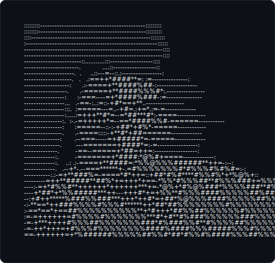

 
  <!-- <b><h2>IT Undergraduate | University of Moratuwa</h2></b> -->

  

 
  
  <!--  -->

  
  

 
Full-Stack Software Engineer with over a year of professional experience and a strong academic foundation in Information Technology from the University of Moratuwa. Delivers reliable, scalable software across the full development lifecycle — from frontend interfaces and RESTful APIs to database design, cloud deployment, and system architecture.

Prioritizes engineering fundamentals over allegiance to any single technology stack, adapting quickly to new tools, frameworks, and environments to apply the right solution for each problem rather than forcing the problem to fit a familiar one. This adaptability, paired with sound technical judgment and a continuous-learning mindset, underpins consistent, dependable delivery.

## Areas of Interest
 
- Full-Stack Software Engineering
- Backend Systems and API Development
- Java and Spring Boot
- React and Modern Frontend Development
- Software Architecture and System Design
- Cloud Technologies and DevOps
- AI-Powered Applications

## Currently Exploring
 
- Microservices Architecture
- Cloud-Native Development (AWS)
- Advanced Spring Boot
- System Design
- Software Engineering Best Practices

  
## Connect

- Website: [sanduni-lakshika.site](https://www.sanduni-lakshika.site/)
- LinkedIn: [linkedin.com/in/sanduni-lakshika](https://www.linkedin.com/in/sanduni-lakshika)
- Medium: [medium.com/@sandunilakshika2026](https://medium.com/@sandunilakshika2026)
- Email: [sandunilakshika2026@gmail.com](mailto:sandunilakshika2026@gmail.com)

   
<h3 align="left">Languages & Tools</h3>

<table align="left">
<td valign="top" width="50%">

<table>
<tr><td colspan="3" align="center"><b>Languages</b></td></tr>
<tr>
<td align="center">Java </td>
<td align="center">JavaScript </td>
<td align="center">TypeScript </td>
</tr>
<tr>
<td align="center">Python </td>
<td align="center">C </td>
</tr>
</table>

</td>
<td valign="top" width="50%">

<table>
<tr><td colspan="3" align="center"><b>Frontend Development</b></td></tr>
<tr>
<td align="center">React </td>
<td align="center">Next.js </td>
<td align="center">React Native </td>
</tr>
<tr>
<td align="center">Tailwind CSS </td>
<td align="center">Bootstrap </td>
<td align="center">HTML5 / CSS3 </td>
</tr>
</table>

</td>
</tr>

<tr>
<td valign="top" width="50%">

<table>
<tr><td colspan="3" align="center"><b>Backend Development</b></td></tr>
<tr>
<td align="center">Node.js </td>
<td align="center">Express.js </td>
<td align="center">Spring Boot </td>
</tr>
<tr>
<td align="center">REST API </td>
<td align="center">JWT </td>
</tr>
</table>

</td>
<td valign="top" width="50%">

<table>
<tr><td colspan="3" align="center"><b>Databases</b></td></tr>
<tr>
<td align="center">MySQL </td>
<td align="center">PostgreSQL </td>
<td align="center">MongoDB </td>
</tr>
<tr>
<td align="center">Redis </td>
<td align="center">SQLite </td>
<td align="center">MS SQL Server </td>
</tr>
</table>

</td>
</tr>

<tr>
<td valign="top" width="50%">

<table>
<tr><td colspan="3" align="center"><b>Cloud & DevOps</b></td></tr>
<tr>
<td align="center">Docker </td>
<td align="center">AWS </td>
<td align="center">Google Cloud </td>
</tr>
<tr>
<td align="center">Firebase </td>
<td align="center">Appwrite </td>
<td align="center">Linux </td>
</tr>
</table>

</td>
<td valign="top" width="50%">

<table>
<tr><td colspan="3" align="center"><b>AI / Machine Learning</b></td></tr>
<tr>
<td align="center">PyTorch </td>
<td align="center">Scikit-learn </td>
<td align="center">OpenCV </td>
</tr>
<tr>
<td align="center">Pandas </td>
</tr>
</table>

</td>
</tr>

<tr>
<td valign="top" width="50%">

<table>
<tr><td colspan="3" align="center"><b>Tools</b></td></tr>
<tr>
<td align="center">Postman </td>
<td align="center">Figma </td>
<td align="center">Git </td>
</tr>
<tr>
<td align="center">GitHub </td>
</tr>
</table>

</td>
<td valign="top" width="50%"></td>
</tr>

</table>

